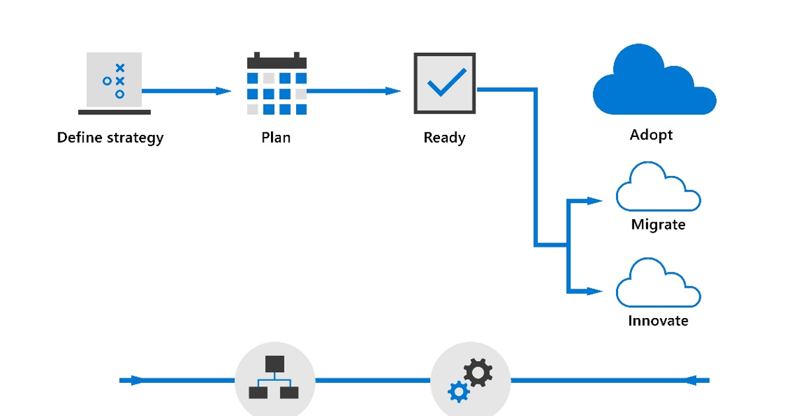

Building an infrastructure migration strategy

Whiteboard design session student guide

July 2021

Information in this document, including URLs and other Internet Web site references, is subject to change without notice. Unless otherwise noted, the example companies, organizations, products, domain names, e-mail addresses, logos, people, places, and events depicted herein are fictitious, and no association with any real company, organization, product, domain name, e-mail address, logo, person, place or event is intended or should be inferred. Complying with all applicable copyright laws is the responsibility of the user. Without limiting the rights under copyright, no part of this document may be reproduced, stored in or introduced into a retrieval system, or transmitted in any form or by any means (electronic, mechanical, photocopying, recording, or otherwise), or for any purpose, without the express written permission of Microsoft Corporation.

Microsoft may have patents, patent applications, trademarks, copyrights, or other intellectual property rights covering subject matter in this document. Except as expressly provided in any written license agreement from Microsoft, the furnishing of this document does not give you any license to these patents, trademarks, copyrights, or other intellectual property.

The names of manufacturers, products, or URLs are provided for informational purposes only and Microsoft makes no representations and warranties, either expressed, implied, or statutory, regarding these manufacturers or the use of the products with any Microsoft technologies. The inclusion of a manufacturer or product does not imply endorsement of Microsoft of the manufacturer or product. Links may be provided to third party sites. Such sites are not under the control of Microsoft and Microsoft is not responsible for the contents of any linked site or any link contained in a linked site, or any changes or updates to such sites. Microsoft is not responsible for webcasting or any other form of transmission received from any linked site. Microsoft is providing these links to you only as a convenience, and the inclusion of any link does not imply endorsement of Microsoft of the site or the products contained therein.

© 2021 Microsoft Corporation. All rights reserved.

Microsoft and the trademarks listed at https://www.microsoft.com/en-us/legal/intellectualproperty/Trademarks/Usage/General.aspx are trademarks of the Microsoft group of companies. All other trademarks are property of their respective owners.

**Contents**

<!-- TOC -->

- [Trainer information](#trainer-information)
  - [Role of the trainer](#role-of-the-trainer)
  - [Whiteboard design session flow](#whiteboard-design-session-flow)
  - [Before the whiteboard design session: How to prepare](#before-the-whiteboard-design-session-how-to-prepare)
  - [During the whiteboard design session: Tips for an effective whiteboard design session](#during-the-whiteboard-design-session-tips-for-an-effective-whiteboard-design-session)
- [Building an infrastructure migration strategy whiteboard design session student guide](#building-an-infrastructure-migration-strategy-whiteboard-design-session-student-guide)
  - [Abstract and learning objectives](#abstract-and-learning-objectives)
  - [Step 1: Review the customer case study](#step-1-review-the-customer-case-study)
    - [Customer situation](#customer-situation)
    - [Customer needs](#customer-needs)
    - [Customer objections](#customer-objections)
    - [Infographic for common scenarios](#infographic-for-common-scenarios)
  - [Step 2: Design a proof of concept solution](#step-2-design-a-proof-of-concept-solution)
  - [Step 3: Present the solution](#step-3-present-the-solution)
  - [Wrap-up](#wrap-up)
  - [Additional references](#additional-references)
- [Building an infrastructure migration strategy whiteboard design session trainer guide](#building-an-infrastructure-migration-strategy-whiteboard-design-session-trainer-guide)
  - [Step 1: Review the customer case study](#step-1-review-the-customer-case-study-1)
  - [Step 2: Design a proof of concept solution](#step-2-design-a-proof-of-concept-solution-1)
  - [Step 3: Present the solution](#step-3-present-the-solution-1)
  - [Wrap-up](#wrap-up-1)
  - [Preferred target audience](#preferred-target-audience)
  - [Preferred solution](#preferred-solution)
  - [Checklist of preferred objection handling](#checklist-of-preferred-objection-handling)
  - [Customer quote (to be read back to the attendees at the end)](#customer-quote-to-be-read-back-to-the-attendees-at-the-end)

<!-- /TOC -->

# Trainer information

Thank you for taking time to support the whiteboard design sessions as a trainer!

## Role of the trainer

An amazing trainer:

- Creates a safe environment in which learning can take place.

- Stimulates the participant's thinking.

- Involves the participant in the learning process.

- Manages the learning process (on time, on topic, and adjusting to benefit participants).

- Ensures individual participant accountability.

- Ties it all together for the participant.

- Provides insight and experience to the learning process.

- Effectively leads the whiteboard design session discussion.

- Monitors quality and appropriateness of participant deliverables.

- Effectively leads the feedback process.

## Whiteboard design session flow

Each whiteboard design session uses the following flow:

**Step 1: Review the customer case study (15 minutes)**

**Outcome**

Analyze your customer's needs.

- Customer's background, situation, needs and technical requirements

- Current customer infrastructure and architecture

- Potential issues, objectives and blockers

**Step 2: Design a proof of concept solution (120-180 minutes)**

**Outcome**

Design a solution and prepare to present the solution to the target customer audience in a 15-minute whiteboard format.

- Determine your target customer audience.

- Determine customer's business needs to address your solution.

- Design and diagram your solution.

- Prepare to present your solution.

**Step 3: Present the solution (30 minutes)**

**Outcome**

Present solution to your customer:

- Present solution

- Respond to customer objections

- Receive feedback

**Wrap-up (15 minutes)**

- Review preferred solution

## Before the whiteboard design session: How to prepare

Before conducting your first whiteboard design session:

- Read the Student guide (including the case study) and Trainer guide.

- Become familiar with all key points and activities.

- Plan the point you want to stress, which questions you want to drive, transitions, and be ready to answer questions.

- Prior to the whiteboard design session, discuss the case study to pick up more ideas.

- Make notes for later.

## During the whiteboard design session: Tips for an effective whiteboard design session

**Refer to the Trainer guide** to stay on track and observe the timings.

**Do not expect to memorize every detail** of the whiteboard design session.

When participants are doing activities, you can **look ahead to refresh your memory**.

- **Adjust activity and whiteboard design session pace** as needed to allow time for presenting, feedback, and sharing.

- **Add examples, points, and stories** from your own experience. Think about stories you can share that help you make your points clearly and effectively.

- **Consider creating a "parking lot"** to record issues or questions raised that are outside the scope of the whiteboard design session or can be answered later. Decide how you will address these issues, so you can acknowledge them without being derailed by them.

***Have fun**! Encourage participants to have fun and share!*

**Involve your participants**. Talk and share your knowledge but always involve your participants, even while you are the one speaking.

**Ask questions** and get them to share to fully involve your group in the learning process.

**Ask first**, whenever possible. Before launching into a topic, learn your audience's opinions about it and experiences with it. Asking first enables you to assess their level of knowledge and experience and leaves them more open to what you are presenting.

**Wait for responses**. If you ask a question such as, "What's your experience with (fill in the blank)?" then wait. Do not be afraid of a little silence. If you leap into the silence, your participants will feel you are not serious about involving them and will become passive. Give participants a chance to think, and if no one answers, patiently ask again. You will usually get a response.

# Building an infrastructure migration strategy whiteboard design session student guide

## Abstract and learning objectives

In this whiteboard design session, you will understand the business need and compelling event leading to a migration and modernization. The compelling event can be defined by financial criteria, regional business drivers, sustainability, security and compliance need or the timing for new products and services the customers is launching.  Position customer needs first in all activities. Be knowledgeable about Cloud industry terms like Gartner 5Rs. 

At the end of the workshop, you will understand how to communicate the Azure Cloud Adoption Framework with the customer and build a holistic business case for apps, infrastructure, and data.  You will know how to engage a solution assessment with an AMMP partner to assist the customer in their migration.  You will understand how to address customer objections, such as response to AWS and Google competitive pressure.

Key success criteria will include: 

*   Communicate the business value and overall benefit to the customer
*   Identify the approach within the Cloud Adoption Framework that includes the strategy, plan, and readiness of workloads
*   Understand and communicate how Azure will address their healthcare compliance needs
*   Provide cost estimates for the proposed migration workloads
*   Move the customer through the process of validation and commitment to the proposal and business case presented

Within the process of completing this session, you will use the Azure Cloud Adoption Framework to develop a business case that will outline the strategy, plan, and readiness of workloads to Azure.  You will communicate the tools that can assist the customer with partner engagement by familiarizing them with the AMMP program.  You will communicate with the customer how moving workloads to Azure can optimize the operations and maintain compliance within their healthcare organization.  As part of the optimization, you should review the customer's licensing position, understand their cost model, and determine their overall strategy for their users, applications, and data.  

## Step 1: Review the customer case study

**Outcome**

Analyze your customer's needs.

Timeframe: 15 minutes

Directions: With all participants in the session, the facilitator/SME presents an overview of the customer case study along with technical tips.

1. Meet your table participants and trainer.

2. Read all of the directions for steps 1-3 in the student guide.

3. As a table team, review the following customer case study.

### Customer situation

Contoso Health is a health provider network that has grown organically and through the acquisition of other smaller healthcare organizations. Over the years, Contoso Health has seen not only its business grow, but also its on-premises presence in their private datacenter. Today, Contoso Health has over 500 servers in their datacenter that are maintained by a lean infrastructure and application support team.

Contoso Health has a longstanding relationship with Microsoft and is a current enterprise customer with an established Enterprise Agreement. Your team represents the migration project team for Contoso Health. You have been tasked with evaluating the processes and tooling and programs that can be used to assess, test, and eventually migrate the workloads to Microsoft Azure and coordinate the use of Microsoft CSP partners, where necessary.

To validate that Microsoft Azure will be able to accommodate Contoso Health's existing servers and applications, a collection of servers has been identified by IT leadership and the business which are representative of Contoso's on-premises estate. While these servers are representative of the current on-premises estate, they are also an existing production system that is critical to the business.

### Customer needs

Limiting risk while maintaining compliance. While the applications selected for this migration effort are representative of Contoso Health's on-premises estate, the are also production systems.
Extend in a stable way. Without access to the source code, the applications cannot be easily modified and are considered stable today. Stability during and after the migration is critical and cannot come at the cost of modernization.

IT leadership's goals for this initial migration to Azure include:

1. Validate the migration of workloads hosted on legacy Linux and Windows operating systems including Windows Server 2008 R2, and Windows Server 2012 R2 as well as systems hosted on Microsoft SQL Server 2008 R2, to take advantage of the additional time offered for vendor support.
  
2. Modernize systems to improve availability and resiliency where possible within the timelines needed for rapid migration. While the overarching goal is to re-host existing systems, where meaningful improvements can be made, they should be.
  
3. Investigate the potential modernization of application components by evaluating and eventually transitioning to platform services where possible after issues around vendor support have been addressed.
  
4. Educate the business and Contoso Health's management on the processes and tooling that can be used to eventually move the remaining servers to Microsoft Azure, drastically reducing their on-premises presence.
   
5. Identify opportunities to optimize operational efficiency and decrease capital expenditures on IT infrastructure.

While each workload will undeniably be different due to different technologies and dependencies, the discovery in this exercise will help to instill a set of practices that can be used to move the remainder of Contoso Health's on-premises estate into Microsoft Azure reliably and predictably.

### Customer objections

1. Contoso Health has a current Enterprise Agreement for all of their Windows Server software that includes Software Assurance.  If they migrate any of their workloads to Azure, they do not have to pay for additional Windows Server licensing.
   
2. The customer currently has servers that are under-utilized most of the year, but need additional capacity during cold weather months due to a rise is health issues.  Contoso does not want to pay extra for server performance that is not used.
   
3. Contoso has servers that run workloads that require a consistent performance level. They are concerned that moving these servers will cost more in Azure.
   
4. Contoso IT staff has limited experience with server migrations and no cloud experience.  It is unlikely that they can handle this type of project along with their current mission-critical application support requirements.

5. Contoso is also discussing their migration to cloud with AWS and Google.  They want to know how Microsoft is any different in services and support.

### Infographic for common scenarios

## Step 2: Design a proof of concept solution

**Outcome**

Design a solution and prepare to present the solution to the target customer audience in a 15-minute chalk-talk format.

Timeframe: 15 minutes

Directions:  With all participants at your table, answer the following questions and list the answers on a whiteboard:

1. Who should you present this solution to? Who is your target customer audience? Who are the decision makers?
2. What internal or external technical and business experts would also be needed in a real-world presentation to decision makers?

*Envision pitch*

1. How will you tie the business needs of Contoso to a positioning statement and value proposition to migrate to Azure?

2. Design a solution and prepare to present the solution that incorporates the CAF/Landing zone to prepare them for migration to the target customer audience in a 15-minute PowerPoint format.

*Business case*

Build a business case for licensing optimization gained from an Azure migration.  Provide the economic and operational benefits to quantify, educate, and guide the customer through Cloud Economics best practices.

1. How can you address Contoso's business needs for economic and operational efficiency?
2. What opportunities are available to optimize licensing and lower overall costs to Contoso?

*Identify engagement with an AMMP partner*

1. How can Microsoft assist Contoso in identifying and introducing an AMMP partner?
2. What objection does utilizing an AMMP partner address?
   
*Outline what will make a successful migration*

Expand on the previous whiteboard design based on Cloud Adoption Framework for Azure and outline a successful migration to a Landing Zone.

1. What criteria of success can you show Contoso that outlines a successful first step to migration?
2. What is the best practice for choosing a workload to be a part of the first Landing Zone?

## Step 3: Present the solution

**Outcome**

Present a solution to the target customer audience in a 15-minute PowerPoint presentation format.  

Validate the value proposition with the customer needs.  Identify the first Landing Zone for migration to Azure. The presentation should outline the Business Case, success criteria for a successful migration, and address all customer needs and objections.

Timeframe: 30 minutes (15 minutes per team presentation)

**Presentation**

Directions:

1. Pair with another table.

2. One table is the Microsoft team and the other table is the customer.

3. The Microsoft team presents their proposed solution to the customer.

4. The customer makes one of the objections from the list of objections.

5. The Microsoft team responds to the objection.

6. The customer team gives feedback to the Microsoft team.

7. Tables switch roles and repeat Steps 2-6.

## Wrap-up

Timeframe: 15 minutes

Directions: Tables reconvene with the larger group to hear the facilitator/SME share the preferred solution for the case study.

## Additional references

- [Microsoft Cloud Workshops](https://microsoftcloudworkshop.com/index.html)
- [Azure Cloud Adoption Framework](https://docs.microsoft.com/en-us/azure/cloud-adoption-framework/)
- [Azure Well-architected Framework](https://docs.microsoft.com/en-us/azure/architecture/framework/)
- [Azure Migration Program - AMP](https://www.microsoft.com/azure/partners/amp)

# Building an infrastructure migration strategy whiteboard design session trainer guide

## Step 1: Review the customer case study

- Check in with your table participants to introduce yourself as the trainer.

- Ask, "What questions do you have about the customer case study?"

- Briefly review the steps and timeframes of the whiteboard design session.

- Ready, set, go! Let the table participants begin.

## Step 2: Design a proof of concept solution

- Check in with your tables to ensure that they are transitioning from step to step on time.

- Provide some feedback on their responses to the business needs and design.

  - Try asking questions first that will lead the participants to discover the answers on their own.

- Provide feedback for their responses to the customer's objections.

  - Try asking questions first that will lead the participants to discover the answers on their own.

## Step 3: Present the solution

- Determine which table will be paired with your table before Step 3 begins.

- For the first round, assign one table as the presenting team and the other table as the customer.

- Have the presenting team present their solution to the customer team.

  - Have the customer team provide one objection for the presenting team to respond to.

  - The presentation, objections, and feedback should take no longer than 15 minutes.

  - If needed, the trainer may also provide feedback.

## Wrap-up

- Have the table participants reconvene with the larger session group to hear the facilitator/SME share the following preferred solution.

## Preferred target audience

- Ken Greenwood, Contoso Healthcare CTO

- Laura Knight, Contoso Healthcare CISO

- Desktop Administrators

- Service Delivery Managers

- Infrastructure, Virtualization, Storage, and Networking Teams

## Preferred solution

*Customer needs*

1. Validate the migration of workloads hosted on legacy Linux and Windows operating systems including Windows Server 2008 R2, and Windows Server 2012 R2 as well as systems hosted on Microsoft SQL Server 2008 R2, to take advantage of the additional time offered for vendor support.

   - Contoso has potentially hardware and software that is coming to end of life or support.  Contoso should evaluate and review the applications that are running on this hardware and understand the potential benefits of migrating these workloads to Azure.
  
2. Modernize systems to improve availability and resiliency where possible within the timelines needed for rapid migration. While the overarching goal is to re-host existing systems, where meaningful improvements can be made, they should be.

   - Discuss evaluating the current life and depreciation of hardware, and whether there are pending capital investments that will need to be made to maintain critical applications infrastructure.
  
3. Investigate the potential modernization of application components by evaluating and eventually transitioning to platform services where possible after issues around vendor support have been addressed.

   - Are there any current applications that could be modernized and migrated to the cloud?  An option here would be possibly a web application or an application that utilizes a common programming language, such as asp.net, java, or C#.
  
4. Educate the business and Contoso Health's management on the processes and tooling that can be used to eventually move the remaining servers to Microsoft Azure, drastically reducing their on-premises presence.

   - Teams should discuss the benefits of using an AMMP partner and the tools that Microsoft has available in Azure for common management of hybrid architectures.  They should also discuss the various migration tools and capabilities with Azure Migrate and replication with Azure Site Recovery.
   
5. Identify opportunities to optimize operational efficiency and decrease capital expenditures on IT infrastructure.

   - Teams should be evaluating the current Enterprise Agreement and how Contoso can leverage hybrid use benefits to decrease Azure infrastructure cost.  In addition, utilizing other infrastructure cost management tools, such as Reserved Instances and Auto-scaling can also maximize operational efficiency while decrease costs.

*Envision pitch*

1. How will you tie the business needs of Contoso to a positioning statement and value proposition to migrate to Azure?

   The envision pitch should be tied to the Microsoft Migration and Modernization value proposition. This value proposition should include the business needs of Contoso.

2. Design a solution and prepare to present the solution that incorporates the CAF/Landing zone to prepare them for migration to the target customer audience in a 15-minute PowerPoint format.

   Teams should be create a whiteboard design that identifies a Landing Zone that follows the Cloud Adoption Framework. This whiteboard design will be a part of the PowerPoint presentation for the envision pitch.  A Landing Zone would be a particular workload that has been identified for Contoso to move to Azure, such as a web application, an application on a virtual machine, or a SQL database.

*Business case*

Build a business case for licensing optimization gained from an Azure migration.  Provide the economic and operational benefits to quantify, educate, and guide the customer through Cloud Economics best practices.

1. How can you address Contoso's business needs for economic and operational efficiency?

   To address the business needs for economic and operational efficiency, the business case should review the current EA licensing, and the current depreciation of hardware and software.  Contoso should be able to take advantage of hybrid use benefits within Azure.  

2. What opportunities are available to optimize licensing and lower overall costs to Contoso?

   The use of hybrid use benefit and reserved instances can help with cost optimization.

*Identify engagement with an AMMP partner*

1. How can Microsoft assist Contoso in identifying and introducing an AMMP partner?

   Microsoft can provide an introduction to an AMMP partner that has healthcare expertise and provide guidance to Contoso.

2. What objection does utilizing an AMMP partner address?

   An AMMP partner can provide expertise that Contoso does not have and assist them in initiating an Azure migration strategy following Cloud Adoption Framework.
   
*Outline what will make a successful migration*

Expand on the previous whiteboard design based on Cloud Adoption Framework for Azure and outline a successful migration to a Landing Zone.

1. What criteria of success can you show Contoso that outlines a successful first step to migration?

   The criteria for success to Contoso should be that they have successfully migrated their first workload and created an Azure Landing Zone.  Teams should show a tangible outcome for operational and economic efficiency.

2. What is the best practice for choosing a workload to be a part of the first Landing Zone?

   In following the Cloud Adoption Framework, part of the planning and ready process is to identify the first workload to migrate to Azure.  The Landing Zone becomes the blueprint for standardization of migration deployment within Azure to govern resources.

## Checklist of preferred objection handling

1. Contoso Health has a current Enterprise Agreement for all of their Windows Server software that includes Software Assurance.  If they migrate any of their workloads to Azure, they do not have to pay for additional Windows Server licensing.

   - The team should be looking at the possibility for Contoso to utilize the hybrid benefits within Azure for Virtual Machines and SQL Databases.
   
2. The customer currently has servers that are under-utilized most of the year, but need additional capacity during cold weather months due to a rise is health issues.  Contoso does not want to pay extra for server performance that is not used.

   - Depending on the application and deployment, Contoso can leverage the auto-scaling capabilities of Azure App Services for their application.  If they are migrating in a "lift and shift" to Virtual Machines, they can create Virtual Machine scale sets and scaling rules to increase and decrease the number of Virtual Machines running the application based on demand.
   
3. Contoso has servers that run workloads that require a consistent performance level. They are concerned that moving these servers will cost more in Azure.

   - Since these workloads are running a predictable and constant performance levels, the team should think about the option of Reserved Instances for Contoso.  Using Reserved Instances can significantly decrease the cost of Virtual Machines and SQL Databases.
   
4. Contoso IT staff has limited experience with server migrations and no cloud experience.  It is unlikely that they can handle this type of project along with their current mission-critical application support requirements.

   - The team should be leveraging and discussing the AMMP program and highlighting the requirements that a partner needs to meet to be a part of the program.  Using an AMMP partner will decrease the time burden of internal IT staff and they will be able to learn about deploying cloud technologies in the process.

5. Contoso is also discussing their migration to cloud with AWS and Google.  They want to know how Microsoft is any different in services and support.

   - Microsoft has tools that allow Contoso to leverage the use of multiple cloud providers and manage them through Azure Arc.  In addition, many of Microsoft's partners also have technical knowledge of other cloud providers.  However, many of the licensing benefits that are provided with Azure usage are not provided when using AWS or Google Cloud.

## Customer quote (to be read back to the attendees at the end)

"Microsoft has designed a secure and manageable infrastructure that can grow with Contoso Healthcare. This depth and breadth will allow us to meet both our business needs and regulatory requirements for our applications. Not to mention ensuring that our healthcare practitioners will have access to the patient data that they need when they need it."

Ken Greenwald, CTO of Contoso Healthcare